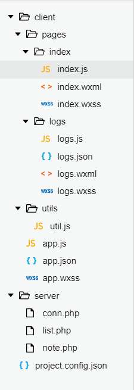

## 留言本及腾讯云服务器配置

## 学习目标

- 掌握微信小程序的腾讯云服务器开发环境的配置；
- 掌握phpmyadmin管理mysql数据库；
- 掌握微信开发者工具的包含服务器端代码的项目配置方法
- 掌握服务器代码上传的方法
- 掌握wx.request api的使用

## 任务描述

首先配置微信小程序的腾讯云服务，然后创建微信小程序项目，配置成包含服务端代码的模式，然后上传服务端代码，编写小程序，在微信开发者工具中调试。

## 任务操作

1. 小程序后台操作：
 a)登陆小程序后台，
 b)记录appID：设置-开发设置  记录下appID
 c)开通腾讯云：设置-开发者工具-腾讯云  

2. 微信开发者工具操作
 新建小程序项目，填入appID，选择“普通快速启动模板”，项目名

## 项目结构

## 项目最终效果图

