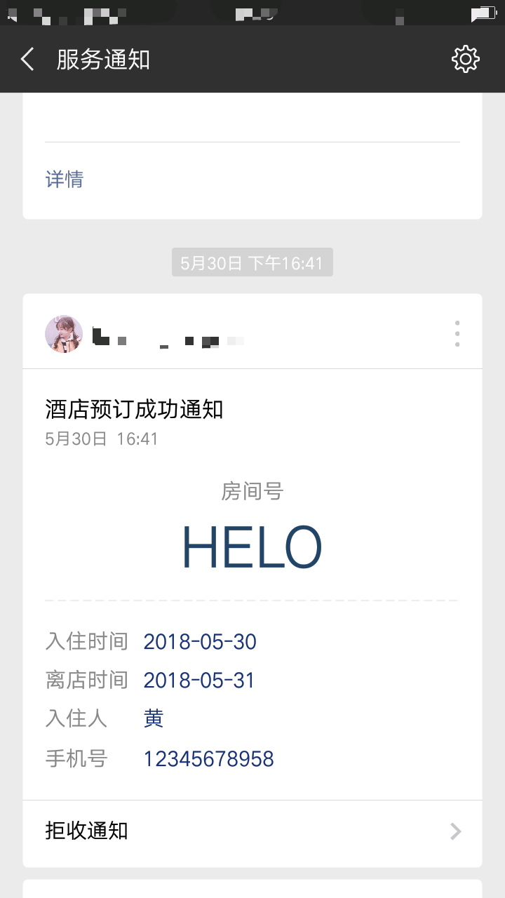
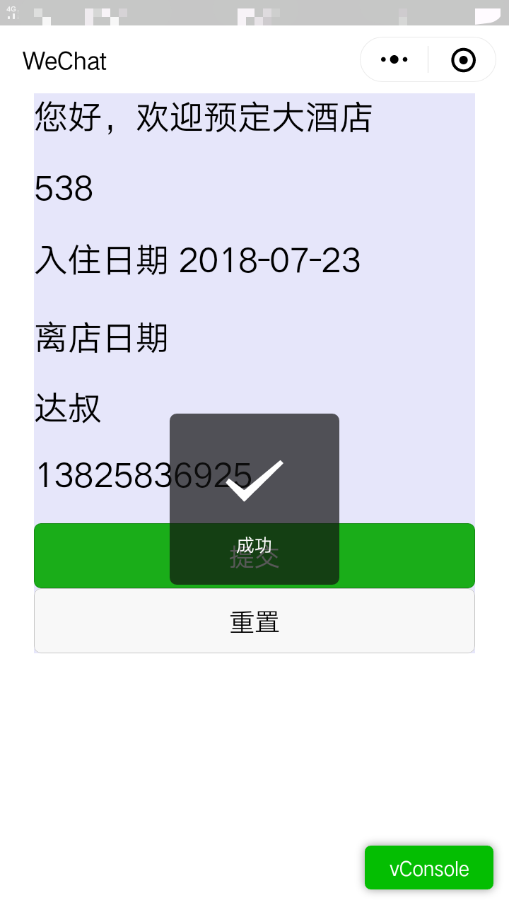

## 酒店预订小程序Demo

## 学习目标：

- 掌握微信小程序wx.login api的机制
- 掌握微信小程序app.js的作用
- 掌握微信小程序form组件的report-submit属性
- 掌握微信小程序picker组件的使用
- 掌握js的prototype方法

- 掌握微信web api的访问技巧
- 掌握php的file_get_contents和curl方法

编写php后台代码完成酒店预订的模板信息推送功能。

[酒店预订小程序Demo](https://files.cnblogs.com/files/dashucoding/%E9%85%92%E5%BA%97%E9%A2%84%E8%AE%A2%E5%B0%8F%E7%A8%8B%E5%BA%8FDemo.rar)

